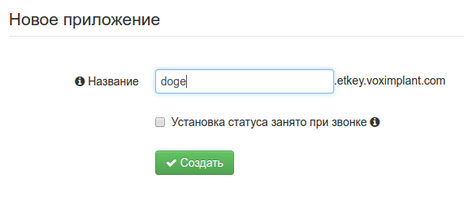
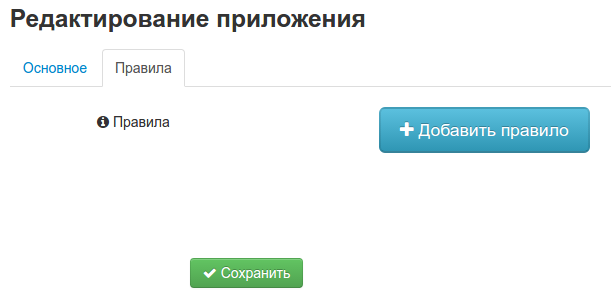
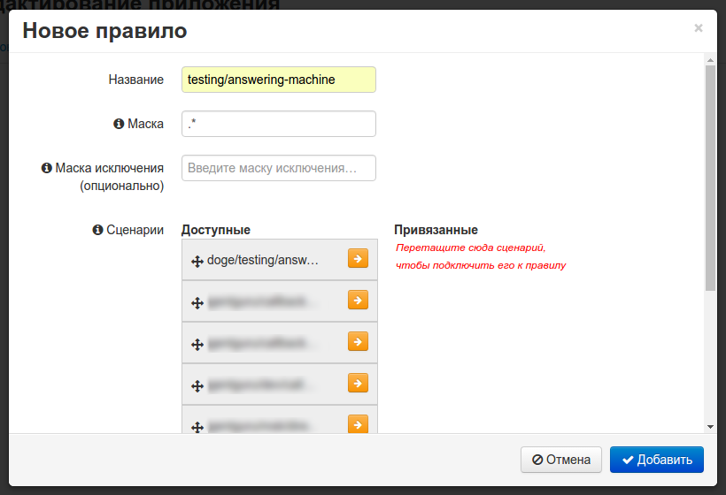
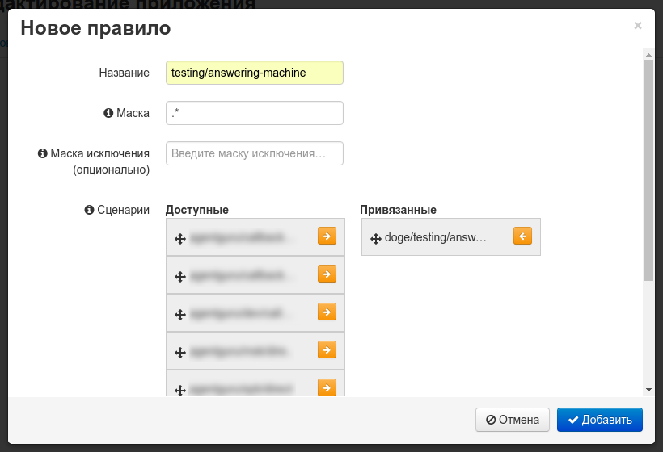
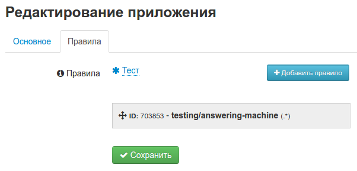
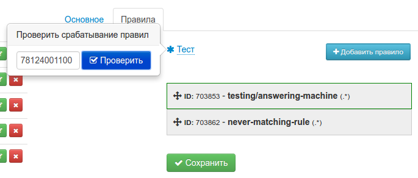
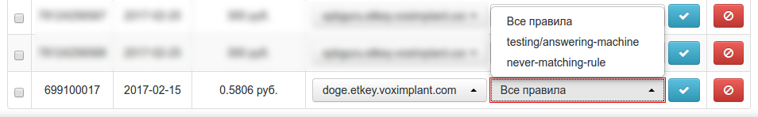

VoxImplant работает в контексте приложений, созданных аккаунтом. Каждый
аккаунт может иметь несколько приложений, выполняющих разные сценарии и
привязанных к разным процессам.

Для какого-либо реального процессинга необходимо создать приложение,
внутри которого будет происходить этот процессинг. Для того, чтобы 
сделать это, необходимо перейти по в "Приложения", нажать на 
"создать приложение" и ввести желаемое имя:

Запуск сценариев VoxImplant производится через правила, которые могут
направить входящий вызов в один из связанных сценариев, либо запустить 
связанные сценарии. Управление правилами происходит в одноименной 
вкладке выбранного приложения.

Для добавления нового правила необходимо нажать соответствующую кнопку,
после чего будет отображено форма создания правила.

В этой форме можно задать регулярные выражения включения и исключения, 
которые будут применяться к принимающему номеру телефона (т.е. тому,
который зарегистрирован в VoxImplant и на который поступает вызов),
чтобы определить факт срабатывания правила. В том случае, если правило 
предназначено только для запуска сценариев вручную или через API, имеет
смысл установить правило исключения, блокирующее любые телефонные 
номера.

В одном приложении может быть сразу несколько правил, поэтому 
рекомендуется сразу выбрать схему именования, при которой будет 
очевидно предназначение каждого правила. В данном случае создается
правило, которое будет запускать сценарий `answering-machine` в
testing-окружении.

После того, как основная информация о правиле была заполнена, 
необходимо выбрать сценарии, которые это правило будет запускать по 
входящему звонку.
 

По завершению редактирования будет отображено меню со всеми правилами
приложения: здесь можно удалить, отредактировать или запустить правило,
запустив таким образом и связанные сценарии.

В этом меню можно проверить, какие правила сработают на входящий 
звонок, используя форму "Тест". Совпадающие с предложенным номером 
правила будут подсвечены:

После того, как правило было создано, остается только подключить номера
к приложению (если требуется обработка входящих вызовов). Для этого 
необходимо перейти в секцию "Номера" и выбрать для соответствующих 
номеров нужное приложение (и, в случае необходимости - конкретное 
правило):

По окончанию этой процедуры звонки, поступающие на выбранные номера,
будут анализироваться указанными правилами, и для них будут вызваны
сценарии, связанные с совпавшими правилами.