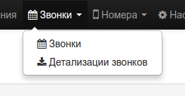
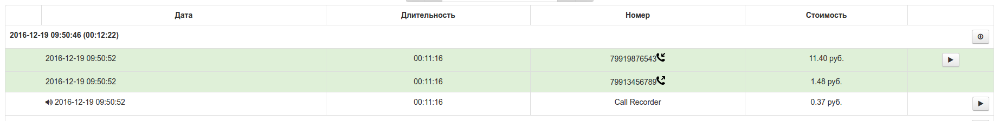
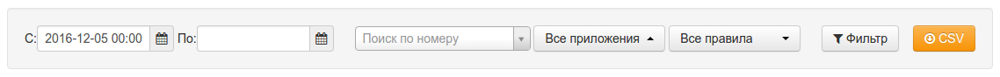

Админ-панель VoxImplant предоставляет пользовательский интерфейс для 
работы со звонками. Перейти на нее можно через пункт меню 
"Звонки -> Звонки":

После этого откроется панель совершенных звонков, в которой каждый 
звонок будет отображен следующим образом:

Здесь отображается

- Время совершения звонка, указанное в UTC - это значит, что для того,
чтобы получить (например) московское время, надо добавить три часа
- Участники звонка - каждый телефонный номер, который так или иначе
поучаствовал в сценарии, будет включен в выкладку вместе со временем
участия, списанной стоимостью, временем участия, записью (если велась).
Иконка со стрелкой, направленной в правый верхний угол означает 
исходящий звонок, противоположная - входящий звонок.
- Дополнительные элементы: лог звонка (иконка в правом верхнем углу) и
запись звонка (дублируется запись одного из участников)

Фильтрация звонков осуществляется с помощью панели поиска:

Здесь можно задать требования к выборке выводимых звонков:
- Период, в который был совершен звонок
- Точное совпадение номера телефона (требуется вводить номер телефона 
в виде строки из цифр - без пробелов, дефисов и прочих дополнительных
символов)
- Приложение VoxImplant, которым был обработан звонок
- Правило приложения, согласно которому звонок был передан в приложение

**NB:** в том случае, если тот или иной номер не стал участником 
звонка, поиск по нему (ожидаемо) осуществляться не будет. В том случае,
если поисковая выдача по конкретному номеру не выдает ожидаемых 
результатов, скорее всего, они отстуствуют из-за того, что сценарий был
прерван до того, как участнику был совершен звонок.