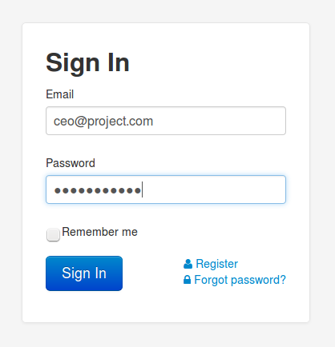
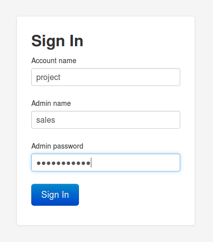

VoxImplant поддерживает два типа аутентификации: вход от имени общего 
аккаунта и вход от имени администратора общего аккаунта. В то время как
первый тип значительно проще, второй позволяет разделить роли между 
администраторами аккаунта и, например, закрыть логику обработку звонков
тем, кому необходимо работать только с историей звонков.

# Вход от имени общего аккаунта

Для того, чтобы зайти под общим аккаунтом, необходимо перейти по ссылке
[https://manage.voximplant.com/#login](https://manage.voximplant.com/#login). 
После этого будет доступна форма стандартного типа:

В которую необходимо ввести email, на который зарегистрирован аккаунт,
и пароль к нему.

# Вход от имени администратора аккаунта

Для аутентификации в качестве администратра аккаунта необходимо перейти
по адресу 
[https://manage.voximplant.com/#loginadmin](https://manage.voximplant.com/#loginadmin), 
где будет выведена следующая форма:

В этой форме необходимо ввести:

- Идентификатор аккаунта
- Идентификатор (не email) администратора
- Пароль администратора

