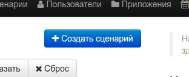
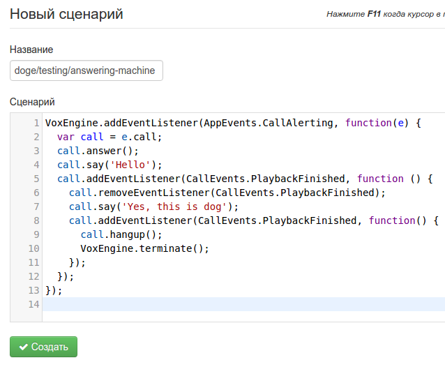
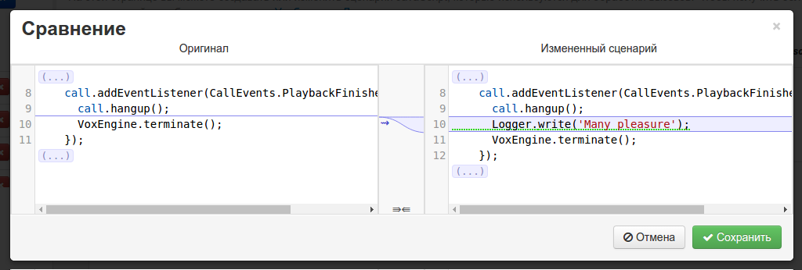

Сценарий - это скрипт на языке JavaScript, который выполняется в 
окружении движка VoxImplant VoxEngine и способен обрабатывать входящие 
и инициировать исходящие звонки. Проект, использующий VoxImplant, 
реализует свою логику обработки звонков с помощью сценариев.
 
VoxImplant не устанавливает ограничений на сценарии, кроме их размера: 
128кб. В сценарии доступен функционал VoxEngine, описанный в 
[официальной документации][voxengine].

# Создание нового сценария

Для создания нового сценария необходимо перейти на страницу "Сценарии"
и нажать соответствующую кнопку:

После этого появится окно редактора сценариев, в котором можно указать 
само тело и имя сценария.

Как было сказано выше, сценарий представляет собой простой скрипт на
языке JavaScript. Писать код можно прямо в редакторе, который 
предоставит автодополнение и проверку синтаксиса, однако разработку
рекомендуется делать в IDE с использованием VCS. В AMA для этого 
используется публичный NPM-пакет [@ama-team/voxengine-definitions][]. 

Рекомендуется сразу выработать конвенцию для именования сценария. 
В данном примере используется формат `{приложение}/{окружение}/{роль}`,
который позволит не запутаться в том, какой сценарий необходимо 
обновлять и совершать автоматическое обновление и добавление сценариев.

Также рекомендуются визуально проверять замечания редактора во 
избежание отправки неработоспособного сценария.

# Обновление сценария

Обновление сценария не отличается практически ничем не отличается от 
создания, кроме возможности просмотреть отличия от предыдущей версии

При обновлении сценария настоятельно рекомендуется пользоваться этим
инструментом, равно как и визуально проверять замечания редактора

Способы выполнения сценария описаны в секции 
"[Работа с приложениями]()"

  [voxengine]: https://voximplant.com/help/faq/what-is-voxengine/
  [@ama-team/voxengine-definitions]: https://www.npmjs.com/package/@ama-team/voxengine-definitions